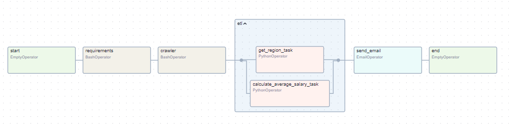
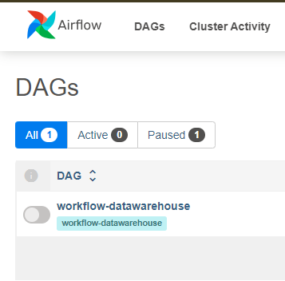
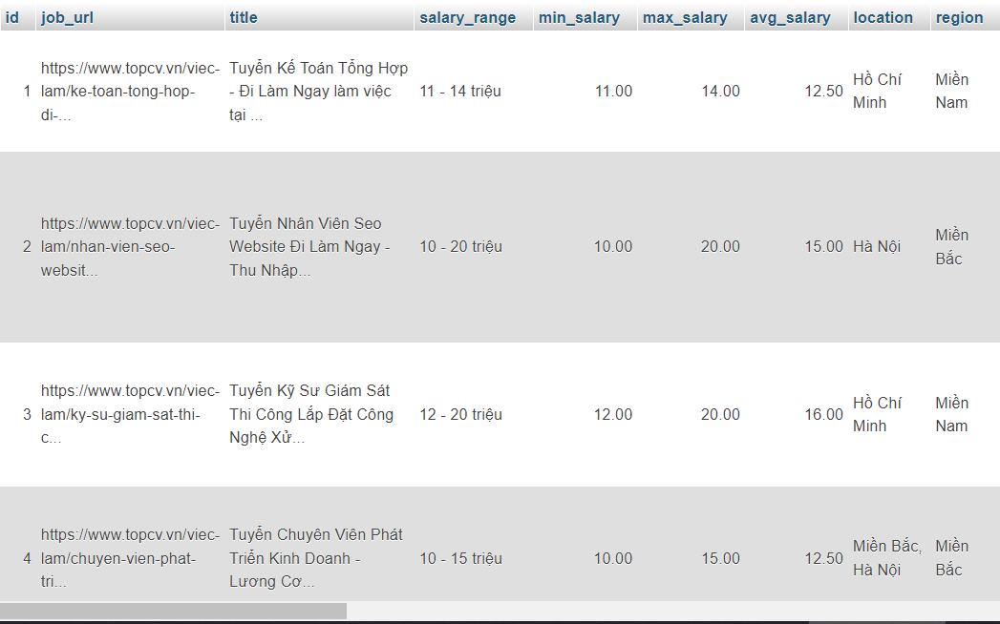

# Bài toán: Thu thập dữ liệu việc làm topcv

_Chú ý: Thu thập dữ liệu phụ thuộc vào sự thay đổi HTML, CSS của trang web_

_Ngày cập nhật: 19/08/2024_

Thu thập dữ liệu trên trang web https://www.topcv.vn, bao gồm các thông tin:

- job_url: Địa chỉ URL công việc
- title: Tiêu đề công việc
- salary_range: Khoảng lương
- location: Địa chỉ công ty
- description: Mô tả công việc
- requirements: Yêu cầu công việc
- benefit: Quyền lợi
- company_url: Địa chỉ URL công ty
- company_name: Tên công ty
- company_avatar: Ảnh công ty
- company_scale: Quy mô công ty
- company_address: Địa chỉ công ty
- position: Vị trí công việc
- experience: Yêu cầu kinh nghiệm
- quantity: Số lượng cần tuyển
- gender: Giới tính yêu cầu
- branch: Lĩnh vực công việc

Các bước Airflow:

- start: Bắt đầu công việc
- requirements: Cài đặt thư viện python cần thiết
- crawler: Thực hiện thu thập dữ liệu
- etl: Tiền xử lý dữ liệu
- send_email: Gửi email thông báo
- end: Kết thúc công việc



# Kỹ thuật

- Apache Airflow: Tự động hóa và lập lịch công việc (Data Pipelines)
- Scrapy: Thu thập dữ liệu ngôn ngữ Python
- MySQL và phpMyAdmin: Quản lý CSDL
- Docker: Đóng gói và triển khai ứng dụng

# Cách sử dụng

_Để có thể chạy dự án này, bạn sẽ cần cài đặt Docker_

Tải xuống bản sao của kho lưu trữ:

```bash
git clone https://github.com/whynotnghiavu/nghia-crawl-data-scrapy-topcv-crawler.git
```

Điều hướng đến `docker-compose.yml`:

```bash
cd contents/code/docker
```

Nếu muốn gửi email thông báo bạn cần tạo file `.env`:

```bash
# .env
AIRFLOW__SMTP__SMTP_USER=example
AIRFLOW__SMTP__SMTP_PASSWORD=example
```

Tạo và khởi động container:

```bash
docker-compose -f "docker-compose.yml" up -d --build
```

Sau khi khởi động, truy cập qua địa chỉ:

- Giao diện airflow: http://localhost:8080
- Thông tin đăng nhập:
  - username: **admin**
  - password: **nghia**
- MySQL: http://localhost:6205

# Ảnh chụp màn hình

- Giao diện airflow ban đầu



- Kết quả sau quá trình trong CSDL MySQL



# Tham khảo

https://www.youtube.com/watch?v=N3Tdmt1SRTM

https://www.youtube.com/watch?v=LtInPTXfdb8
